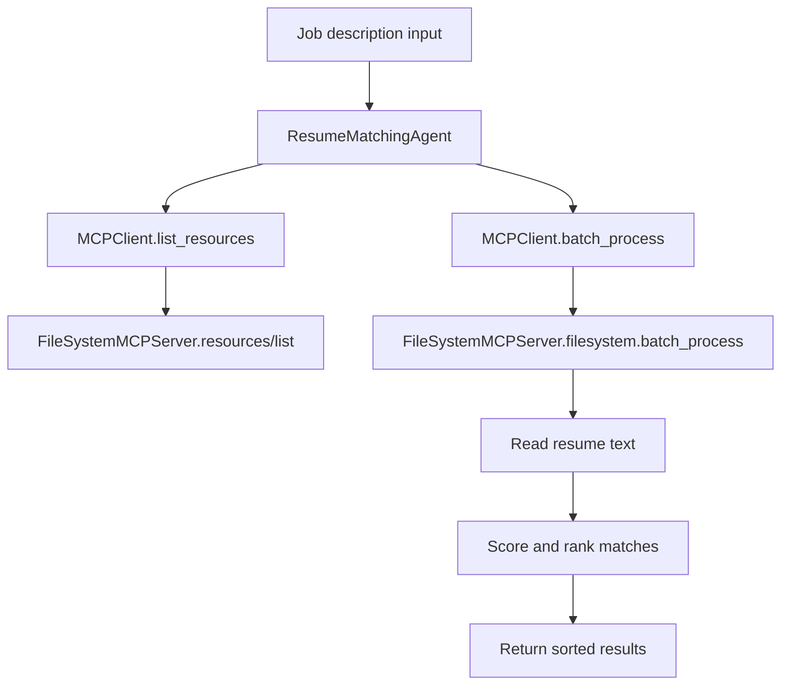

# Resume Matching MCP Demo

This project implements a JSON-RPC 2.0 filesystem MCP server and a resume matching agent that consumes MCP resources instead of directly manipulating the filesystem.

## Project structure

```text
resume-matching-mcp/
├── src/
│   ├── filesystem_mcp_server.py
│   ├── matching_agent.py
│   ├── mcp_client.py
│   └── config.py
├── data/
│   ├── resumes/
│   └── job_descriptions/
├── tests/
│   ├── test_mcp_server.py
│   ├── test_watch_directory.py
│   ├── test_batch_process.py
│   └── test_agent.py
├── docs/
│   └── workflow.md
├── .env
├── .gitignore
├── requirements.txt
├── README.md
└── .venv/
```

## MCP server capabilities

- `resources/list` for resource discovery
- `filesystem.read_file` to read a resume file
- `filesystem.list_directory` to inspect directory contents
- `filesystem.watch_directory` to monitor new resume uploads
- `filesystem.batch_process` to scan and read multiple files efficiently

## Agent workflow



## Verification

Run:

```bash
python -m pytest -q
```

Current result from this workspace:

```text
6 passed in 0.21s
```

## Notes

- The filesystem access is isolated behind the MCP server so the agent remains decoupled from local tool implementation details.
- The design is ready for future integration with additional MCP servers such as web search or database-backed enrichment.
