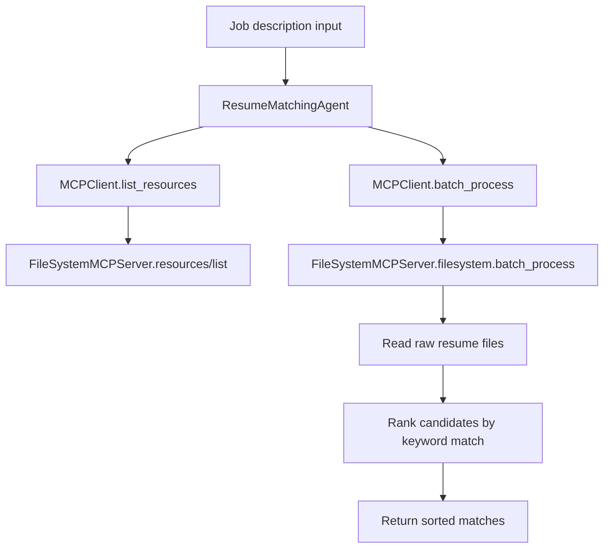

# Resume Matching Workflow

The agent interacts with the filesystem through an MCP client instead of importing file-system helpers directly. This keeps the matching logic decoupled from local file access and makes it easier to add additional MCP servers later.
